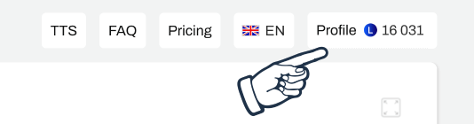
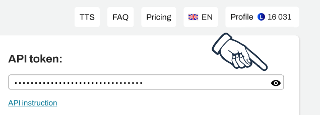

# Speechgen.txt

Diese Datei wird verwendet, um die [speechgen.io](https://speechgen.io/) API in den Arbeitsablauf zu integrieren. Dadurch werden die benötigten Audiodateien automatisch im Hintergrund heruntergeladen und im [Audio-Ordner](https://github.com/c-smo/TalkTree-Edit/blob/main/Anleitungen/Audio/Audio.md) gespeichert.

Um dieses Feature zu verwenden, benötigst du einen Account auf Speechgen.io und solltest vermutlich ein wenig Guthaben aufladen. Es gibt zwar ein gratis "Probier-Kontingent", aber dieses ist sehr schnell erschöpft.

Als Referenz: Ich habe zu Beginn der Entwicklung einmalig 5€ aufgeladen und habe immer noch die Hälfte davon zur Verfügung (und ich habe schon so manches einsprechen lassen).

---

## Einrichtung:

1. **Account erstellen und Guthaben aufladen**  
   Besuche [speechgen.io](https://speechgen.io/). Nachdem du deinen Account angelegt und ausreichend Guthaben hast, klicke **oben rechts** auf "Profil".  
   

2. **API-Token abrufen:**  
   Wir benötigen den **"API-Token"**. Drücke auf das **"Auge"**, um diesen anzeigen zu lassen.  
   

3. **Stimme auswählen**  
   Kehre zurück auf die Startseite und notiere dir den Namen der Stimme, die verwendet werden soll.

---

### Konfiguration in Speechgen.txt

Sobald du alle benötigten Informationen hast, kehre zu der Datei **"Speechgen.txt"** zurück und füge die benötigten Werte ein.

**Beispiel:**

```
API-Token: 123456789
E-Mail: deine@e.Mail
Stimme: Ryan DE  <- Beispiel einer validen Stimme
```

---

## Schlussbemerkung

Zukünftig sollten die Audiodateien automatisch heruntergeladen werden. Wenn es sich nur um eine einzelne Datei handelt - z. B. weil nur ein Knopf hinzugefügt wurde - geschieht dies unbemerkt im Hintergrund.

Ab zwei Dateien bittet die App um Erlaubnis, bevor der Download gestartet wird.

Solltest du nicht mehr wollen, dass die Dateien automatisch heruntergeladen werden, kannst du einfach die Datei “Speechgen.txt” löschen.
