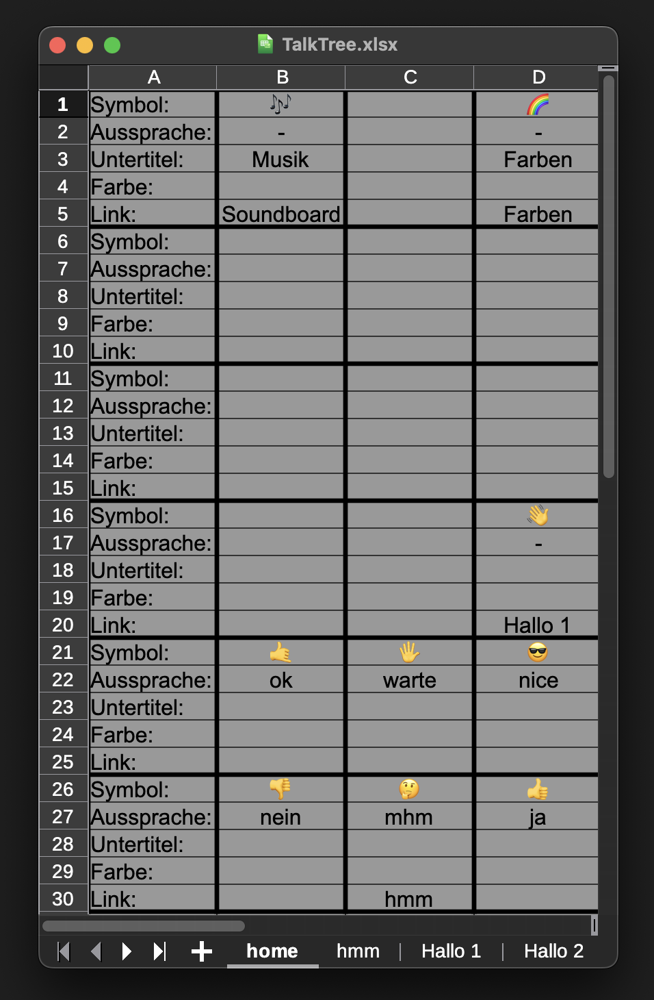
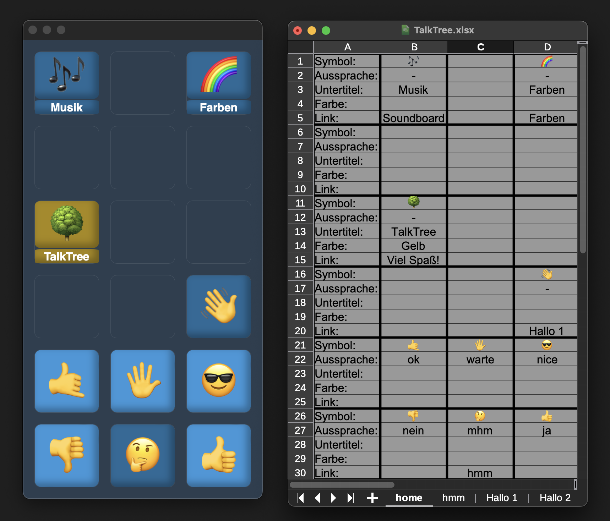

# Vorwort

Vielen Dank, dass du TalkTree ausprobierst und damit einen wichtigen Beitrag dazu leistest, der App zu helfen, ihr volles Potenzial zu entfalten! Das Projekt befindet sich aktuell noch in der Entwicklung, daher ist es wahrscheinlich, dass sich noch einiges ändern wird. Fehler und Bugs können leider noch auftreten 🤫. Mein Ziel ist es jedoch, möglichst früh Feedback zu erhalten. Änderungsvorschläge, Wünsche und Fragen sind daher herzlich willkommen!

# Erste Schritte

## Download:

### Windows

- [TalkTree Editor | Windows](https://github.com/c-smo/TalkTree-Edit/releases/download/v0.1.0/TalkTree.Editor_v0.1.0_x64-setup.exe)

---

### MacOS

- [TalkTree Editor | arm](https://github.com/c-smo/TalkTree-Edit/releases/download/v0.1.0/TalkTree.Editor_v0.1.0_aarch64.dmg)

- [TalkTree Editor | intel](https://github.com/c-smo/TalkTree-Edit/releases/download/v0.1.0/TalkTree.Editor_v0.1.0_x64.dmg)

---

## Installation:

Wähle ein beliebiges Verzeichnis und installiere das Programm.

## Weitere Schritte:

Nach der Installation solltest du eine Datei mit dem Namen **"TalkTree Editor"** in deinem gewählten Installationsverzeichnis finden.

Beim Start sucht/erstellt das Programm die Projektstruktur auf deinem Desktop in einem Ordner mit dem Namen **TalkTree**.

In diesem Ordner findest du Folgendes:

### Überblick:

- [/Audio](https://github.com/c-smo/TalkTree-Edit/blob/main/Anleitungen/Audio/Audio.md)
- [/Bilder](https://github.com/c-smo/TalkTree-Edit/blob/main/Anleitungen/Bilder/Bilder.md)
- /Einstellungen

  - [Einstellungen.txt](https://github.com/c-smo/TalkTree-Edit/blob/main/Anleitungen/Einstellungen/Einstellungen.md)
  - [Farben.txt](https://github.com/c-smo/TalkTree-Edit/blob/main/Anleitungen/Einstellungen/Farben.md)
  - [Server.txt](https://github.com/c-smo/TalkTree-Edit/blob/main/Anleitungen/Einstellungen/Server.md)
  - [Speechgen.txt](https://github.com/c-smo/TalkTree-Edit/blob/main/Anleitungen/Einstellungen/Speechgen.md)

- **_TalkTree.xlsx_**

In dieser Anleitung fokussieren wir uns auf die Datei **TalkTree.xlsx**.

---

# TalkTree.xlsx

Diese Datei ist das Herzstück der App und wird verwendet, um diese zu bearbeiten. Öffne sie in einem Programm deiner Wahl. Ich verwende [LibreOffice](https://de.libreoffice.org/), aber jedes Programm, das Excel-Dateien bearbeiten kann, sollte funktionieren.



Die Datei ist nur als Muster gedacht und kann beliebig bearbeitet werden. Alle Änderungen sollten nach dem Speichern der Excel-Datei sofort im TalkTree Editor sichtbar werden.

Die erste Seite, die man beim Start der App sieht, ist die Tabelle mit dem Namen **"home"** (**Wichtig:** die App sucht nach einer Tabelle mit diesem Namen und es werden Fehler auftreten wenn diese nicht vorhanden ist).

Auf dieser Seite solltest du ein 3 x 6-Raster sehen mit den folgenden Werten in der ersten Spalte: **Symbol, Aussprache, Untertitel, Farbe, Link.**

---

# Bearbeitung:

Du hast die Möglichkeit, "TalkTree.xlsx" folgendermaßen zu bearbeiten:

## Symbol:

1. **Einfach leer lassen:**  
   Der Knopf wird nicht erscheinen.

2. **Text/Emoji:**  
   Jede Art von Text ist möglich. Das Programm versucht, die Länge dynamisch anzupassen, damit dieser in den Knopf passt. Dennoch würde ich abraten, allzu lange Wörter zu verwenden – "Rindfleischetikettierungsüberwachungsaufgabenübertragungsgesetz" ist vielleicht nicht ideal. :D

3. **Bilddatei:**  
   Genauere Infos findest du [hier](https://github.com/c-smo/TalkTree-Edit/blob/main/Anleitungen/Bilder/Bilder.md).

---

## Aussprach

1. **Einfach leer lassen:**  
   Das Programm wird den Text im Symbol vorlesen.

2. **Ein anderer Text:**  
   Das Programm wird diesen Text vorlesen, anstatt das Symbol.

3. **-**  
   Das Programm wird nichts vorlesen.

4. **Audiodatei:**  
   Genauere Infos findest du [hier](https://github.com/c-smo/TalkTree-Edit/blob/main/Anleitungen/Audio/Audio.md).

---

## Untertitel:

1. **Einfach leer lassen:**  
   Kein Untertitel.

2. **Text:**  
   Dieser Text erscheint als Untertitel unter dem Knopf.

---

## Farbe:

1. **Einfach leer lassen:**

   Das Programm verwendet die [Standardfarbe](https://github.com/c-smo/TalkTree-Edit/blob/main/Anleitungen/Einstellungen/Farben.md), diese kann beliebig angepasst werden.

2. **Eine Farbe per Name wählen:**

   Siehe Tabelle mit dem Namen "Farben" für Beispiele.

3. **Es ist auch möglich, eigene [Farben](https://github.com/c-smo/TalkTree-Edit/blob/main/Anleitungen/Einstellungen/Farben.md) zu verwenden.**

---

## Link:

1. **Einfach leer lassen:**  
   Der Knopf verlinkt automatisch auf die "home"-Tabelle.

2. **Anderer Tabellenname:**  
   Der Knopf verlinkt zu der Tabelle mit dem angegebenen Namen.

3. **Eigener Tabellenname:**  
   Der Knopf verlinkt zurück auf die gleiche Tabelle.

---

**Beispiel:**



```
Symbol:           🌳       <- Dargestellt wird 🌳
Aussprache:       -        <- Kein TTS
Untertitel:    TalkTree    <- Unter dem Symbol steht "TalkTree"
Farbe:           Gelb      <- Der Knopf ist gelb
Link:          Viel Spaß!  <- und verlinkt auf die Tabelle "Viel Spaß!"
```

---

# Schlusswort

Mit diesen einfachen Werkzeugen hast du unheimlich viele Möglichkeiten. Bei der Entwicklung war ich selber ziemlich erstaunt, was man damit alles machen kann. Ich habe ein paar Beispiele in der Excel-Datei gelassen, um dich ein bisschen zu inspirieren, aber das Potenzial ist bei weitem nicht erschöpft. Ich bin wirklich gespannt, auf welche Ideen die Community so kommen wird.

Ich wünsche viel Freude beim erschaffen!

Chris
