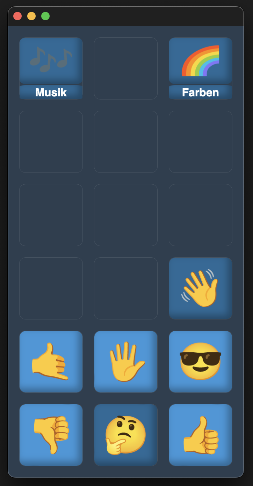

# TalkTree – UK Framework

   

TalkTree soll eine offene und zugängliche Plattform bieten, die Menschen mit Kommunikationsbarrieren dabei unterstützt, die eigene Stimme zu finden. Durch eine Vielzahl von Anpassungsmöglichkeiten lässt sich die App ganz individuell auf den Bedarf der Nutzer*innen* abstimmen.

Ein weiterer wichtiger Aspekt bei der Entwicklung war, die Bearbeitung so einfach wie möglich zu gestalten, um sowohl Angehörigen als auch Betreuer*inne*n zu ermöglichen, ohne große Hindernisse auf die Bedürfnisse der Nutzer*innen* eingehen zu können.

Dieses Programm ist unter der [MIT](https://github.com/c-smo/TalkTree-Edit/blob/main/LICENSE.md) Lizenz veröffentlicht und daher kostenfrei erhältlich. Mein Ziel ist es jedem Menschen die Möglichkeit zu schaffen, ein ganz persönliches Bäumchen zu pflanzen 🌱

Wenn du es kaum erwarten kannst loszulegen, lese am besten direkt [hier](https://github.com/c-smo/TalkTree-Edit/blob/main/TalkTree_Edit/Anleitungen/Erste_Schritte.md) weiter.

---

## Datenschutz

Ein kurzes aber wichtiges Wort zum Thema [Datenschutz](https://github.com/c-smo/TalkTree-Edit/blob/main/TalkTree_Edit/Devlog/Datenschutz.md).

---
## Neuigkeiten

### 05.02 Part 2

Jap, auf Apple ist Verlass :) Ich habe herausgefunden, welche hinterlistigen Wege sie nutzen, um der Gesetzeslage zu entsprechen – aber es für eine tatsächliche Implementierung quasi unbrauchbar zu machen. Eine PWA auf iOS ist auf ca. 50-100 MB limitiert. Für kleine Bäumchen mag das reichen, aber auf kurz oder lang wird man auf Probleme stoßen. Außerdem habe ich in einem Open-Source-Forum gelesen, dass iOS ca. einmal jährlich den Cache (die gespeicherte Inhalte) spaßeshalber löscht.

Jetzt bleibt nur noch die Möglichkeit, die betriebssysteminterne Stimme von iOS zu nutzen und auf MP3-Dateien zu verzichten. Zum Glück ist die ziemlich gut. Wenn das in PWAs auch nicht geht, habe ich keine Kraft mehr – mein Nervenkostüm ist absolut überstrapaziert, und TalkTree wird iOS vorerst nicht supporten.

Ich habe noch die Hoffnung, dass die EU endlich ihre vorhandenen Gesetze anwendet und Apple zwingt, sich an die Regeln zu halten. Sobald das dann vielleicht irgendwann mal der Fall ist, wird iOS - zumindest in der EU - unterstützt.

P.S.: Für diejenigen, die sich vielleicht wundern, was das Problem ist, die App im App Store zu veröffentlichen: Es kostet Geld, und da ich dieses Programm kosten- und werbefrei anbieten möchte, ist das ein ausschlaggebender Punkt. Ganz abgesehen davon, dass ich ganz klar der Überzeugung bin, dass so ein Verhalten von einem Milliardenkonzern intolerierbar ist.

### 05.02 Ich komme (hoffentlich) mit guten Nachrichten!

Guten Morgen,  
ich hatte mal wieder eine sehr kurze Nacht – wie schon öfter, seit mich dieses Projekt vereinnahmt hat :D – aber es hat sich gelohnt … hoffe ich. Ich präsentiere:  

  

"Was ist denn das?" höre ich euch murmeln (vielleicht ist es auch nur der Schlafentzug, den ich höre, aber ja). Was ihr hier seht, sieht zwar nicht nach viel aus, ist aber ein riesengroßer Schritt.  

Wie sich herausstellt, muss meine Lieblingsfirma (sie haben es versucht zu verweigern, aber diesmal ist es nicht gelungen) ein Feature namens "PWA" erlauben. Für die Nicht-Nerds unter uns: Eine "PWA" ist eine Möglichkeit, Websites in "Programme" umzuwandeln, die auch offline verfügbar sind (Das ist, glaube ich, der Grund, warum sie es erlauben müssen, da es theoretisch sicherheitsrelevant sein kann, gewisse Websites auch offline verfügbar zu haben). Der 🌳-Knopf spielt die Datei *Hallo.mp3* ab, wenn man ihn drückt.

Das ganze ermöglicht mir dem Programm die Fähigkeit zu geben, den Inhalt von "TalkTree Editor" lokal im eigenen Netzwerk als Website zu hosten. Man kann dann innerhalb des eigenen Netzwerks auf diese Website zugreifen und sie als "PWA" auf (soweit ich weiß) jedem Gerät speichern.

**TL;DR:** Alle Features, die benötigt werden, um TalkTree auf iOS laufen zu lassen, sind in diesem Screenshot vorhanden! Der sceenshot stammt von meinem iPad. Es wird vermutlich wieder ziemlich viel Arbeit, aber das hat mich bisher auch nicht abgeschreckt. Ich bin wieder vorsichtig optimistisch. Wenn ich eins während diesem Projekt gelernt habe, dann ist es: Man darf sich bei Apple nicht zu früh freuen.

Wir werden sehen.  

P.S.: Es kann gut sein, dass zukünftig gar keine Android-/iOS-Version mehr benötigt wird, da eine PWA theoretisch von Haus aus auf jedem Gerät laufen kann. Vielleicht hat es Apple durch ihre endlose Gier unbeabsichtigt geschafft, mich auf eine viel bessere Alternative aufmerksam zu machen. Des wär witzig :D

P.P.S.: Um mit diesem Feature herum zu experimentieren, werde ich ein neues [Repo](https://github.com/c-smo/TalkTree-PWA) anlegen. "TalkTree Editor" und "TalkTree App" bleiben erstmal unverändert, da es – zumindest auf Android – aktuell funktioniert.

[mehr](https://github.com/c-smo/TalkTree-Edit/blob/main/TalkTree_Edit/Devlog/NEWS.md)

---
## Download & Installation

- Wähle dein [Betriebssystem](https://github.com/c-smo/TalkTree-Edit/blob/main/TalkTree_Edit/Anleitungen/Installation/download.md)

---

## Anleitungen
- [Erste Schritte](https://github.com/c-smo/TalkTree-Edit/blob/main/TalkTree_Edit/Anleitungen/Erste_Schritte.md) 

- [Weitere Informationen](https://github.com/c-smo/TalkTree-Edit/blob/main/TalkTree_Edit/Anleitungen/Inhalt.md)

---

## Kontakt

Christopher Smolic  
c-smolic@proton.me
