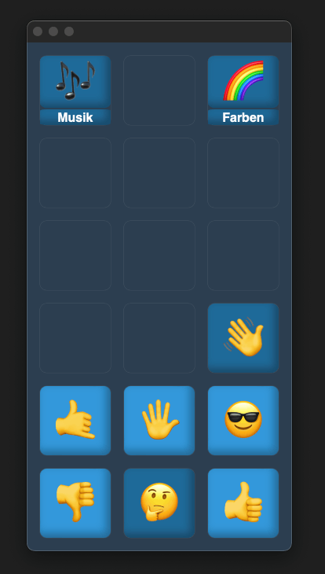

# TalkTree – UK Framework

   

TalkTree soll eine offene und zugängliche Plattform bieten, die Menschen mit Kommunikationsbarrieren dabei unterstützt, die eigene Stimme zu finden. Durch eine Vielzahl von Anpassungsmöglichkeiten lässt sich die App ganz individuell auf den Bedarf der Nutzer:innen abstimmen.

Ein weiterer wichtiger Aspekt bei der Entwicklung war, die Bearbeitung so einfach wie möglich zu gestalten, um sowohl Angehörigen als auch Betreuer:innen zu ermöglichen, ohne große Hindernisse auf die Bedürfnisse der Nutzer:innen eingehen zu können.

Dieses Programm ist unter der [MIT](https://github.com/c-smo/TalkTree-Edit/blob/main/LICENSE.md) Lizenz veröffentlich und daher kostenfrei erhältlich. Mein Ziel ist es jedem Menschen die Möglichkeit zu schaffen, ein ganz persönliches Bäumchen zu pflanzen 🌱

## Download:

- [TalkTree Editor | Windows](https://github.com/c-smo/TalkTree-Edit/releases/download/v0.1.0/TalkTree.Editor_v0.1.0_x64-setup.exe)

- [TalkTree Editor | MacOS-aarch64](https://github.com/c-smo/TalkTree-Edit/releases/download/v0.1.0/TalkTree.Editor_v0.1.0_aarch64.dmg)

~~[App | Android](URL)~~ _to-do_

~~[App | iOS](URL)~~ _to-do_

## Einleitung:

- [Erste Schritte](https://github.com/c-smo/TalkTree-Edit/blob/main/Anleitungen/Erste_Schritte.md)

## Weitere Anleitungen:

- [Audio](https://github.com/c-smo/TalkTree-Edit/blob/main/Anleitungen/Audio/Audio.md)
- [Bilder](https://github.com/c-smo/TalkTree-Edit/blob/main/Anleitungen/Bilder/Bilder.md)
- Einstellungen

  - [Einstellungen](https://github.com/c-smo/TalkTree-Edit/blob/main/Anleitungen/Einstellungen/Einstellungen.md)
  - [Farben](https://github.com/c-smo/TalkTree-Edit/blob/main/Anleitungen/Einstellungen/Farben.md)
  - [Server](https://github.com/c-smo/TalkTree-Edit/blob/main/Anleitungen/Einstellungen/Server.md)
  - [Speechgen](https://github.com/c-smo/TalkTree-Edit/blob/main/Anleitungen/Einstellungen/Speechgen.md)

## Kontakt

- Christopher Smolic
- c-smo@users.noreply.github.com
