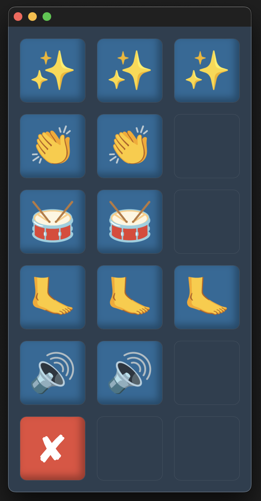

# Audio

Standardmäßig liest die App den Text in der Zeile „Symbol“ mittels Text-to-Speech (TTS) vor. Ist die Zeile „Aussprache“ ausgefüllt, wird deren Inhalt bevorzugt.

Um die Audio-Wiedergabe für einen Knopf zu deaktivieren, genügt es, ein **" - "** in die Zeile „Aussprache“ einzufügen.

Für die TTS-Wiedergabe verwendet die App die **betriebssysteminterne Stimme**, deren Qualität jedoch oft leider überschaubar ist. Es gibt aber Alternativen.

**_Side Note: Während der Entwicklung der Endgeräte-App ist mir aufgefallen, dass iOS inzwischen ziemlich gute Stimmen bietet, die man herunterladen kann. Android holt auch langsam auf. Die genaue Integration muss ich mir noch anschauen, das Thema habe ich aber auf dem Schirm :) Eine kostenfreie und nahtlose Implementierung von qualitativ hochwertiger TTS-Wiedergabe wäre ideal und könnte so möglicherweise realisierbar sein._**

## Text-to-Speech

Eine Liste aller Wörter, die noch keine verknüpfte Audio-Datei haben, findest du in der Datei [Neu.txt](https://github.com/c-smo/TalkTree-Edit/blob/main/TalkTree_Edit/Anleitungen/Audio/Neu.md). Sie befindet sich im Audio-Ordner und wird bei jedem Start des Editors neu generiert.

---

1. **Speechgen.io**:  
   Der Editor kann mit [Speechgen.io](https://github.com/c-smo/TalkTree-Edit/blob/main/TalkTree_Edit/Anleitungen/Einstellungen/Speechgen.md) verbunden werden, um benötigte TTS-Dateien automatisch im Hintergrund herunterzuladen.

   Speechgen.io ist ein Dienst, der Text in Sprache umwandelt. Ich habe mich für diese Plattform entschieden, da sie meiner Meinung nach gute Stimmen bietet und die Preise ok sind.

   Das Hauptargument war jedoch, dass kein Abo erforderlich ist. Stattdessen kann man, ähnlich wie bei einem Prepaid-Handy, Guthaben aufladen und dieses flexibel nutzen. Als Referenz: Zu Beginn der Entwicklung habe ich einmalig 5€ aufgeladen, und trotz zahlreicher Sprachaufnahmen ist noch fast die Hälfte des Guthabens übrig.

2. **Alternative TTS-Anbieter**:  
   Es gibt eine Vielzahl von TTS-Anbietern, und es lohnt sich, die Augen offen zu halten, da es in diesem Bereich aktuell rasante Entwicklungen gibt.

3. **Beliebige mp3-Dateien**:  
   Ein Knopf kann jede beliebige **mp3**-Datei abspielen. Hierfür genügt es dieser Audio-Datei denselben Namen wie die Zeile "Symbol" zu geben und sie in den Audio-Ordner zu legen. Auch hier wird der Inhalt der Zeile "Aussprache" bevorzugt, falls in dieser eine Eingabe vorhanden ist.

---

   

---

## Beispiele

**Beispiel 1:**

```
Symbol:           🥁
Aussprache:    M-snare-1
Untertitel:
Farbe:
Link:          Soundboard
```

Dieser Knopf spielt die Datei **"M-snare-1.mp3"** ab, da sie sich als Beispiel bereits im Audio-Ordner befindet.

---

**Beispiel 2:**

```
Symbol:        Du
Aussprache:
Untertitel:
Farbe:
Link:
```

Dieser Knopf sucht die Datei **"Du.mp3"** im Audio-Ordner. Da sie nicht vorhanden ist, wird der Text über die betriebssysteminterne TTS-Wiedergabe vorgelesen.

---

**Beispiel 3:**

```
Symbol:        🎶
Aussprache:    -
Untertitel:   Musik
Farbe:
Link:       Soundboard

```

Bei diesem Knopf ist die Audio-Wiedergabe deaktiviert.
