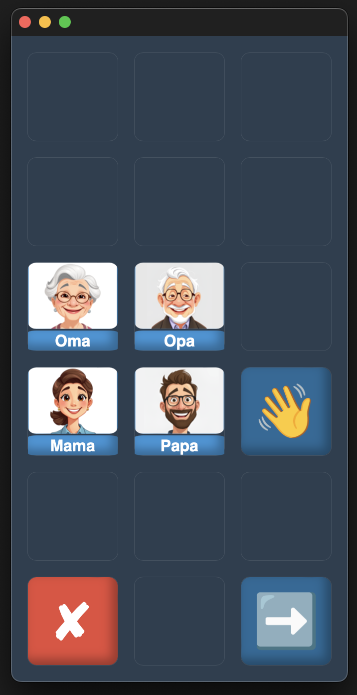

# Bilder

Ein Knopf kann beliebige Bild-Dateien in den Formaten **png**, **jpg** und **jpeg** anzeigen. Dazu muss die Datei bloß denselben Namen wie die Zeile „Symbol“ tragen und im Bilder-Ordner abgelegt werden.

Ich empfehle **.png**, da hier ein transparenter Hintergrund möglich ist. Zur Bildbearbeitung verwende ich meistens [Photopea](https://www.photopea.com/).

Wird keine passende Datei im Bilder-Ordner gefunden, erscheint der Text aus der Spalte "Symbol" als reguläre Schrift auf dem Knopf.

   

## Bevorzugte Bildformate:

**_Side Note: Die angegebenen Formate sind aktuell nicht korrekt (glaub ich :D). Ich bin gerade dabei, verschiedene Ansätze auszuprobieren._**

**Knopf ohne Untertitel:**  
Breite: 400px
Höhe: 400px

**Knopf mit Untertitel:**  
Breite: 400px  
Höhe: 300px

Die Dimensionen sollten aber, abgesehen vom verwendeten Speicherplatz und der Qualität, ansonsten keinen Einfluss haben, da das Programm die Bilder auf die benötigte Größe skaliert.

---

**Beispiel 1:**

```
Symbol:         Oma
Aussprache:
Untertitel:     Oma
Farbe:
Link:
```

Dieser Knopf zeigt das Bild **Oma.png**, da diese Datei im Bilder-Ordner als Beispiel bereits vorhanden ist.

---

**Beispiel 2:**

```
Symbol:           👋
Aussprache:     Hallo
Untertitel:
Farbe:
Link:           Hallo 1
```

Dieser Knopf zeigt 👋, da es keine Datei mit dem Namen **👋.png** im Bilder-Ordner gibt.

---

**Beispiel 3:**

```
Symbol:          Wo?
Aussprache:    Wo ist
Untertitel:
Farbe:
Link:           Namen
```

Dieser Knopf würde den Text **"Wo?"** als reguläre Schrift anzeigen. Die Schriftgröße wird dynamisch angepasst.
