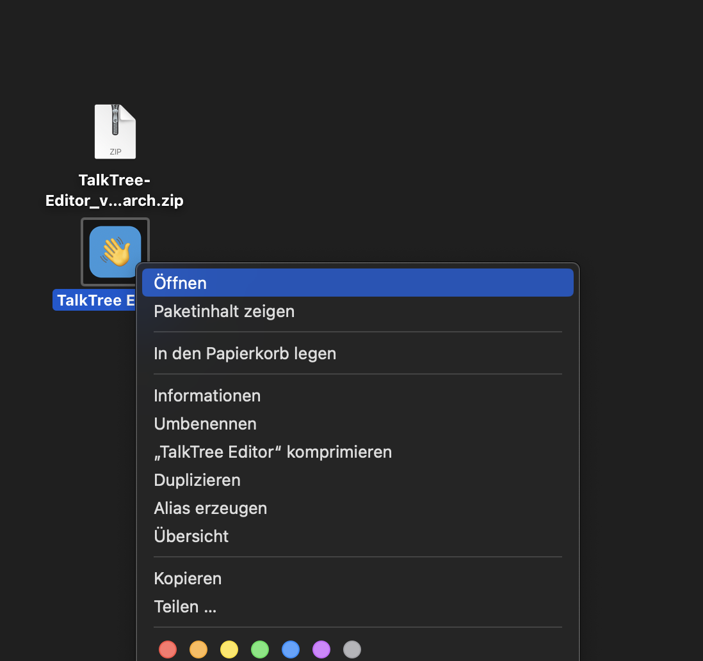
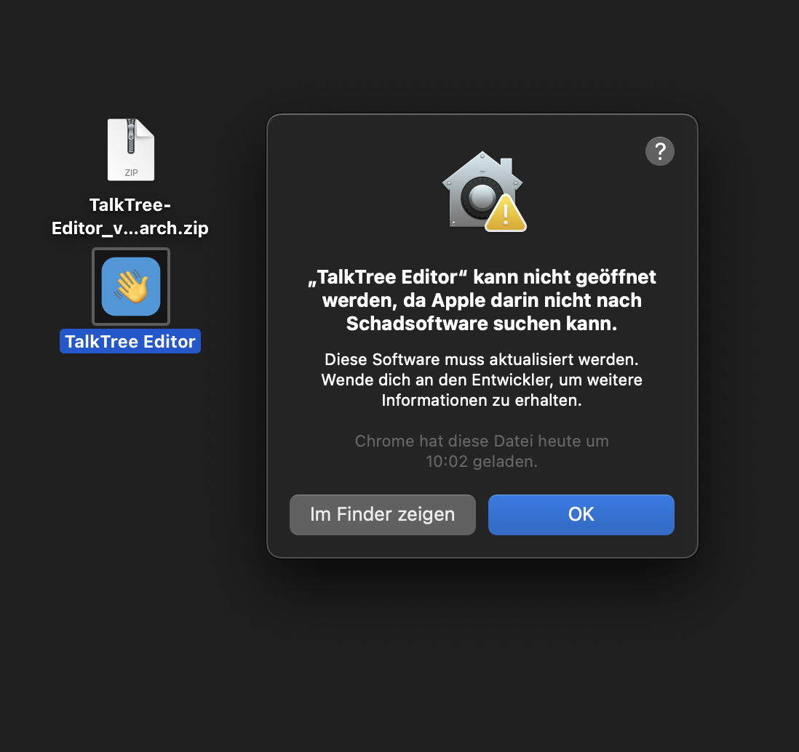
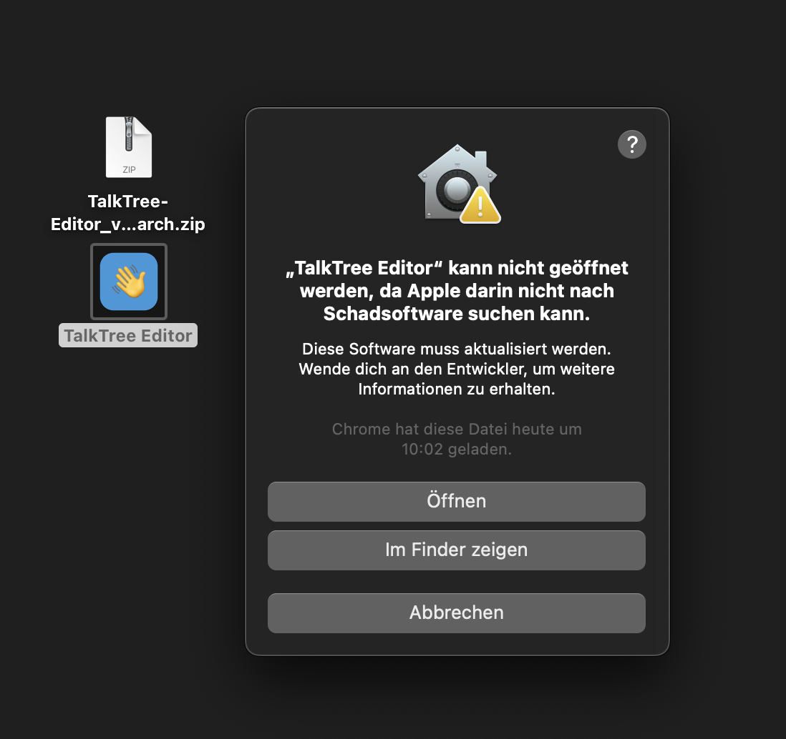

# Installation auf MacOS

---

**_Update 03.02: Da eine iOS-Implementierung ohne Developer-Account so gut wie unrealisierbar ist, habe ich es getan… Ich will es gar nicht aussprechen… :D Naja, beim nächsten Update werde ich auch die macOS-Version signieren, dann kann man sich diesen furchtbaren Prozess hier hoffentlich ersparen._**

---

**_Hinweis: Bitte bewahren Sie während des Prozesses Ihre Ironie-Reserven. Das wiederholte Klicken durch dystopische Warnhinweise kann in der Open-Source-Community nachweislich zu akuter Sarkasmus-Exazerbation führen._**

Apple verwendet äußerst kreative Methoden, um potenzielle Kunden zu ermutigen, jährlich 99 € in einen Developer-Account zu investieren – für das Privileg, Software für andere Menschen zugänglich zu machen.

Da ich dieses Geschäftsmodell kategorisch ablehne, bleibt nur der Weg über selbstsignierte Zertifikate. Diese werden pauschal als Bedrohung klassifiziert. Aber keine Sorge, Apple hat sich besonders viel Mühe gegeben, eine Installation innerhalb des großzügig interpretierten gesetzlichen Spielraums zu ermöglichen und diesen Prozess maximal benutzer*innen*freundlich zu gestalten.

## Download

- [TalkTree Editor | arm](https://github.com/c-smo/TalkTree-Edit/releases/download/v0.3.1/TalkTree.Edit-v0.3.1-aarch64.zip)
- [TalkTree Editor | intel](https://github.com/c-smo/TalkTree-Edit/releases/download/v0.3.1/TalkTree.Edit-v0.3.1-x86_64.zip)

### Anwendung öffnen

Entpacke die **.zip**-Datei.

---

### Erster Versuch

Rechtsklick auf die App > „Öffnen“

   

---

### Apple präsentiert ein Meisterwerk regulatorischer Präzision

„OK“ klicken – Mutprobe bestanden!

   

**_Hinweis: Man beachte die kunstvolle Differenzierung. Es handelt sich keineswegs um einen Nachweis von Schadsoftware – was man bei Vorliegen derselben natürlich sofort nach dem Entpacken feststellen würde – sondern schlicht um die erhabene Weigerung, auch weiterhin danach zu suchen. Ein wahrhaft avantgardistischer Ansatz im Risikomanagement._**

---

### Zweiter Versuch

Erneut Rechtsklick > „Öffnen“

---

### Uns wird gestattet das Programm zu öffnen

Und plötzlich, wie durch Zauberhand, erscheint das Freigabefenster. Schade, dass diese Option, höchstwahrscheinlich aus technischen Gründen, erst nach zwei Anläufen darstellbar ist.

---

### Los geht's :)

Nach Abschluss der Installation kannst du sofort loslegen. Ich empfehle aber, dir einen kurzen Überblick über die Möglichkeiten zur [Bearbeitung](https://github.com/c-smo/TalkTree-Edit/blob/main/TalkTree_Edit/Anleitungen/Erste_Schritte.md#bearbeitung) zu verschaffen.
