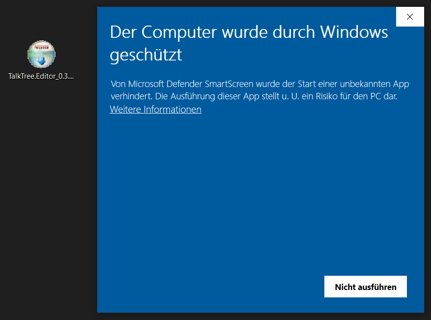

# Installation auf Windows

Obwohl Microsoft ebenfalls Stolpersteine für Open-Source-Software in den Weg legt, finde ich ihre Herangehensweise im Gegensatz zu Apple akzeptabel, da natürlich ein gewisses Risiko besteht, wenn man unbekannte Applikationen aus dem Internet installiert. Eine neutralere Formulierung wäre wünschenswert, aber dieser Wunsch ist vermutlich utopisch.

## Download

- [TalkTree Editor | Windows](https://github.com/c-smo/TalkTree-Edit/releases/download/v0.3.1/TalkTree.Editor_0.3.1_x64-setup.exe)

### Anwendung öffnen

Starte die **.exe**-Datei.

---

### Microsoft warnt vor potenziellen Risiken

Wähle - „Weitere Informationen“

   

---

### Jetzt kannst du das Programm starten

Wähle - „Trotzdem ausführen“

   

---

### Los geht's :)

Nach Abschluss der Installation kannst du sofort loslegen. Ich empfehle aber, dir einen kurzen Überblick über die Möglichkeiten zur [Bearbeitung](https://github.com/c-smo/TalkTree-Edit/blob/main/TalkTree_Edit/Anleitungen/Erste_Schritte.md#TalkTree.xlsx) zu verschaffen.
