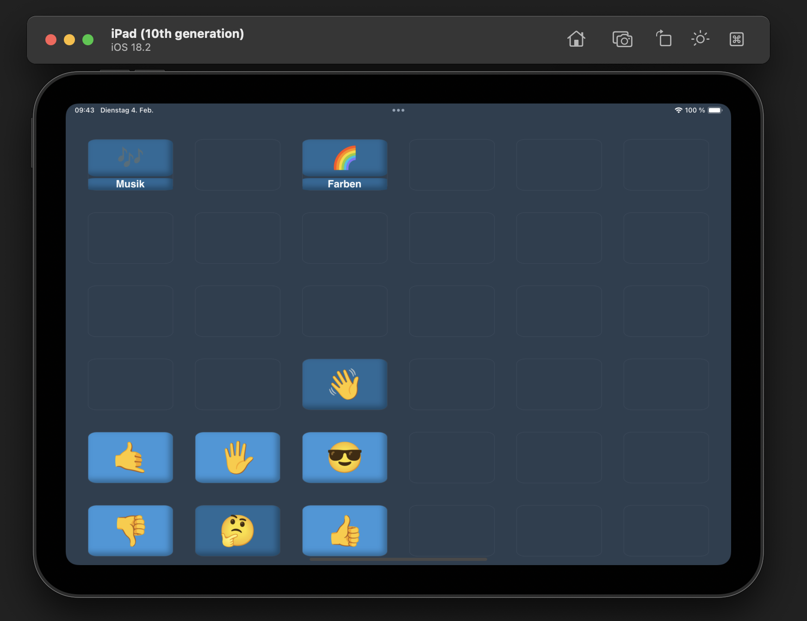

## Neuigkeiten

### 05.02 Part 2

Jap, auf Apple ist Verlass :) Ich habe herausgefunden, welche hinterlistigen Wege sie nutzen, um der Gesetzeslage zu entsprechen – aber es für eine tatsächliche Implementierung quasi unbrauchbar zu machen. Eine PWA auf iOS ist auf ca. 50-100 MB limitiert. Für kleine Bäumchen mag das reichen, aber auf kurz oder lang wird man auf Probleme stoßen. Außerdem habe ich in einem Open-Source-Forum gelesen, dass iOS ca. einmal jährlich den Cache (die gespeicherte Inhalte) von PWAs spaßeshalber löscht.

Jetzt bleibt nur noch die Möglichkeit, die betriebssysteminterne Stimme von iOS zu nutzen und auf MP3-Dateien zu verzichten. Zum Glück ist die ziemlich gut. Wenn das in PWAs auch nicht geht, habe ich keine Kraft mehr – mein Nervenkostüm ist absolut überstrapaziert, und TalkTree wird iOS vorerst nicht supporten.

Ich habe noch die Hoffnung, dass die EU endlich ihre vorhandenen Gesetze anwendet und Apple zwingt, sich an die Regeln zu halten. Sobald das dann vielleicht irgendwann mal der Fall ist, wird iOS - zumindest in der EU - unterstützt. Obwohl ich befürchte, dass Apple einfach die Strafe zahlen wird und weiter macht wie bisher, da sie sich natürlich auf diese illegale Art ein goldenes Näschen verdienen und die Strafe dazu sehr wahrscheinlich nicht ansatzweise in Relation steht.

P.S.: Für diejenigen, die sich vielleicht wundern, was das Problem ist, die App im App Store zu veröffentlichen: Es kostet Geld, und da ich dieses Programm kosten- und werbefrei anbieten möchte, ist das ein ausschlaggebender Punkt :( Ganz abgesehen davon, dass ich ganz klar der Überzeugung bin, dass so ein Verhalten von einem Milliardenkonzern intolerierbar ist...

### 05.02 Ich komme (hoffentlich) mit guten Nachrichten!

Guten Morgen,  
ich hatte mal wieder eine sehr kurze Nacht – wie schon öfter, seit mich dieses Projekt vereinnahmt hat :D – aber es hat sich gelohnt … hoffe ich. Ich präsentiere:

"Was ist denn das?" höre ich euch murmeln (vielleicht ist es auch nur der Schlafentzug, den ich höre, aber ja). Was ihr hier seht, sieht zwar nicht nach viel aus, ist aber ein riesengroßer Schritt.

Wie sich herausstellt, muss meine Lieblingsfirma (sie haben es versucht zu verweigern, aber diesmal ist es nicht gelungen) ein Feature namens "PWA" erlauben. Für die Nicht-Nerds unter uns: Eine "PWA" ist eine Möglichkeit, Websites in "Programme" umzuwandeln, die auch offline verfügbar sind (Das ist, glaube ich, der Grund, warum sie es erlauben müssen, da es theoretisch sicherheitsrelevant sein kann, gewisse Websites auch offline verfügbar zu haben). Der 🌳-Knopf spielt die Datei _Hallo.mp3_ ab, wenn man ihn drückt.

Das ganze ermöglicht mir dem Programm die Fähigkeit zu geben, den Inhalt von "TalkTree Editor" lokal im eigenen Netzwerk als Website zu hosten. Man kann dann innerhalb des eigenen Netzwerks auf diese Website zugreifen und sie als "PWA" auf (soweit ich weiß) jedem Gerät speichern.

**TL;DR:** Alle Features, die benötigt werden, um TalkTree auf iOS laufen zu lassen, sind in diesem Screenshot vorhanden! Der sceenshot stammt von meinem iPad. Es wird vermutlich wieder ziemlich viel Arbeit, aber das hat mich bisher auch nicht abgeschreckt. Ich bin wieder vorsichtig optimistisch. Wenn ich eins während diesem Projekt gelernt habe, dann ist es: Man darf sich bei Apple nicht zu früh freuen.

Wir werden sehen.

P.S.: Es kann gut sein, dass zukünftig gar keine Android-/iOS-Version mehr benötigt wird, da eine PWA theoretisch von Haus aus auf jedem Gerät laufen kann. Vielleicht hat es Apple durch ihre endlose Gier unbeabsichtigt geschafft, mich auf eine viel bessere Alternative aufmerksam zu machen. Des wär witzig :D

P.P.S.: Um mit diesem Feature herum zu experimentieren, werde ich ein neues [Repo](https://github.com/c-smo/TalkTree-PWA) anlegen. "TalkTree Editor" und "TalkTree App" bleiben erstmal unverändert, da es – zumindest auf Android – aktuell funktioniert.

---

### 04.02 - Part Two

Zu früh gefreut… Das Programm läuft zwar problemlos auf meinem iPad, aber Apple ist immer für eine Überraschung gut und verlangt jetzt, dass ich die App zur """Begutachtung""" einreiche, bevor sie auf anderen Geräten laufen darf. Ich habe mir die Liste der Anforderungen angesehen – da wird einem bissi schlecht. Außerdem müsste ich ihnen meinen GitHub-Repo schicken, davor sollte ich vermutlich erst ein paar meiner Kommentare löschen :D

Der einzige Grund, warum ich überhaupt noch in Betracht ziehe, mit iOS weiterzumachen, ist, dass iPads nun mal leider der "Standard" sind… Aber will man wirklich ein Unternehmen unterstützen, das so arbeitet? Android-Tablets (oder noch besser Linux) sind nicht nur deutlich günstiger, sondern trauen einem sogar zu, selbst zu entscheiden, welche Programme man nutzen möchte.

Ich bin wirklich kurz davor, eine NGO zu gründen, die Linux-Tablets mit der TalkTree-App zu einem Bruchteil der Kosten anbietet, die aktuell für so ein Paket verlangt werden – nur um diesen ganzen gierigen Konzernen eins auszuwischen…

Alles in allem bin ich gerade unheimlich frustriert und wütend. Ich habe genug für heute :(

P.S.: Aaaber :D zumindest ist der build für v0.4.0 gleich fertig! Oberflächlich wird man keine großen Unterschiede feststellen, aber hinter den Kulissen hat sich einiges getan.

---

### 04.02 - Weiter gehts!

Kaum zu glauben, Apple stimmt jetzt aus irgendeinem Grund zu, dass die App sicher ist. Merkwürdig. Naja, wie dem auch sei, die iPad-Version erblickt das Licht der Welt! :) Ich muss noch ein paar Bugs beheben, aber viel fehlt nicht mehr. Ich hoffe, bis Ende der Woche stehen Versionen für alle erdenklichen Geräte zur Verfügung.

---

### 03.02 - Ohne Worte

Der Account muss noch bestätigt werden, kann bis zu 2 Tage dauern.

   

---

### 02.02 - iOS Integration

Ich habe mich über die Möglichkeiten einer iOS-Integration informiert. Obwohl die [EU 2024 ein Gesetz beschlossen hat](https://digital-strategy.ec.europa.eu/de/news/commission-sends-preliminary-findings-apple-and-opens-additional-non-compliance-investigation#:~:text=Die%20Europ%C3%A4ische%20Kommission%20hat%20Apple,f%C3%BCr%20Angebote%20und%20Inhalte%20lenken.), das Apple dazu motivieren soll, Geräte endlich für Drittanbieter zu öffnen, ist dies bis dato immer noch nur bedingt möglich. Außerhalb der EU ist es schlicht unmöglich.

Ich gebe noch nicht auf, aber aktuell sieht es nicht gut aus :(

P.S.: Um diese Neuigkeit aber auf einer positiven Note abzuschließen: Bevor es gar keine Alternative für iPads gibt (eigentlich ist iOS nur wegen iPads interessant, weil diese bereits in den meisten Einrichtungen verfügbar sind), werde ich das Geld lieber investieren um eine Website zu hosten, auf die man mit dem iPad zugreifen kann, um das Programm von dort zu starten. Ich habe auch noch 1-2 Ideen wie ich Apple vielleicht doch überreden kann. Des wird scho ois! :)

P.P.S.: Im Worst Case lege ich mir zähneknirschend doch noch einen Developer-Account zu.

---

### 01.02 – Die nächsten Schritte

Die Version v0.3 scheint aktuell stabil zu sein – mir sind keine Fehler bekannt. Falls euch etwas auffällt, gebt mir bitte Bescheid, damit ich es beheben kann.

Als Nächstes starte ich mit der iOS-Implementierung. Drückt mir die Daumen – Apple und ich sind momentan nicht die besten Freunde.

---

### 31.01 - Neue Kontakt E-Mail

Ich dachte, die “c-smo@users.noreply.github.com”-Adresse leitet Nachrichten direkt an mich weiter, aber da habe ich mich getäuscht. Tut mir leid, falls jemand vergeblich auf eine Antwort gewartet hat. Ich habe die E-Mail Adresse jetzt ausgetauscht.

---

Hier geht es [zurück](https://github.com/c-smo/TalkTree-Edit?tab=readme-ov-file#neuigkeiten) zur Startseite.
